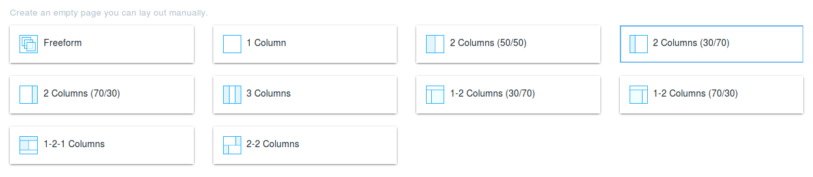
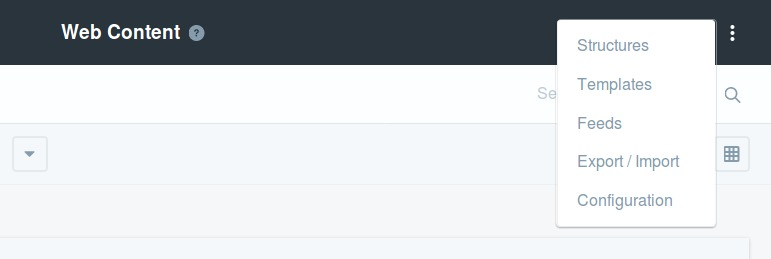
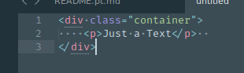

# Liferay Front End Developer – Primeiros Passos

## Sumário

1. [Preparação de Ambiente](#1-preparação-de-ambiente)
    1. [Java JDK](#11-java-jdk)
    2. [MySQL 5.6](#12-mysql-56)
    3. [Node.JS e NPM](#13-nodejs-e-npm)
    4. [Yeoman](#14-yeoman)
    5. [Gulp](#15-gulp)
    6. [Gerador de código](#16-gerador-de-código)
    7. [Liferay + Tomcat Bundle](#17-liferay--tomcat-bundle)
2. [Fundamentos](#2-fundamentos)
3. [Ferramentas](#3-ferramentas)
    1. [Blade CLI](#31-blade-cli)
    2. [Liferay Theme Generator](#32-liferay-theme-generator)
        1. [Criando um novo Tema](#321-criando-um-novo-tema)
        2. [Alterando a estrutura da página](#322-alterando-a-estrutura-da-página)
        3. [Criando novos layouts para o portal](#323-criando-novos-layouts-para-o-portal)
        4. [Criando Themelets](#324-criando-themelets)
        5. [Importando um tema](#325-importando-temas)
4. [Componentes do Front End](#4-componentes-do-front-end)
    1. [Linguagens utilizadas](#41-linguagens-utilizadas)
        1. [HTML & Estrutura](#411-html--estrutura)
            - [FreeMarker](#freemarker)
            - [Soy Templates (Google Closure)](#soy-templates-google-closure)
        2. [CSS](#412-css)
        3. [JavaScript](#413-javascript)
    2. [ADTs](#42-adts)
    3. [Web Content Structures & Templates](#43-web-content-structures--templates)
        1. [Web Content Structures](#431-web-content-structures)
        2. [Web Content Templates](#432-web-content-templates)
    4. [Componentes Liferay UI](#44-componentes-liferay-ui)
    5. [Gulp Tasks](#45-gulp-tasks)
        1. [Gulp build](#451-gulp-build)
        2. [Gulp deploy](#452-gulp-deploy)
        3. [Gulp watch](#453-gulp-watch)
        4. [Gulp init](#454-gulp-init)
        5. [Gulp extend](#455-gulp-extend)
        6. [Gulp status](#456-gulp-status)
5. [Boas Práticas de Front-End](#5-boas-práticas-de-front-end)
    1. [Configuração](#51-configuração)
    2. [Formatação de código](#52-formatação-de-código)
        1. [HTML/TPL/FTL](#521-htmltplftl)
        2. [CSS/SCSS](#522-cssscss)
        3. [JS](#523-js)
    3. [Liferay Front End Source Formatter](#53-liferay-front-end-source-formatter)
6. [Utilidades](#6-utilidades)
7. [Certificação Liferay](#7-certificação-liferay)
    1. [Liferay 6.2 Certified Professional Developer](#71-liferay-62-certified-professional-developer)
    2. [Liferay DXP Certified Professional Front-End Developer](#72-liferay-dxp-certified-professional-front-end-developer)
    3. [Liferay DXP Certified Professional Back-End Developer](#73-liferay-dxp-certified-professional-back-end-developer)
8. [Code snippets](#8-code-snippets)
    - [Blog / Web content](#blog--web-content)

-----

## 1. Preparação de Ambiente
Será apresentado um tutorial para preparação de ambiente e primeiros passos na plataforma Liferay para Desenvolvedores Front End, com base no treinamento oficial Liferay e mais algumas informações fornecidas pela equipe da Liferay USA.
Todos os passos foram executados em ambiente Linux, distribuição Ubuntu 16.04.

### 1.1 Java JDK
Para a execução do servidor local do Liferay, é preciso instalar a versão 1.8 do Java Development Kit (JDK) e acrescentar o endereço da pasta `bin` do JDK no início da variável PATH (através do arquivo `~/.bashrc`).
Também é preciso definir as variáveis de ambiente `JAVA_HOME` e `JDK_HOME`, com o endereço de instalação do JDK, sem a pasta bin.

No final do arquivo .bashrc, foram inseridas as linhas:

```bash
export JAVA_HOME=/path/to/jdk (substituir)
export JDK_HOME=$JAVA_HOME
export PATH="$JDK_HOME/bin:$PATH"
```

### 1.2 MySQL 5.6
É preciso também fazer a instalação do MySQL 5.6, embora a Plataforma do Liferay utilize por padrão o HSQL (Hyper SQL), eles não o recomendam para ambiente de produção.
A instalação pode ser feita através desses comandos.

```bash
sudo add-apt-repository 'deb http://archive.ubuntu.com/ubuntu trusty universe'
sudo apt-get update
sudo apt install mysql-server-5.6
sudo apt install mysql-client-5.6
```

### 1.3 Node.JS e NPM
Para muitas tarefas no Front End, é indispensável o Node.JS, para o Liferay não é diferente, é utilizada a plataforma Node para possibilitar a criação e teste de novos temas.
Utilizaremos o NVM para instalar o Node, pois é uma maneira de permitir instalar múltiplas versões do Node, facilitando o teste em outras versões e retorno à versões anteriores quando necessário.
Para instalar o Node.JS no Ubuntu, foram utilizados os seguintes comandos:

```bash
sudo apt-get update
sudo apt-get install build-essential libssl-dev
curl -sL https://raw.githubusercontent.com/creationix/nvm/v0.31.0/install.sh -o install_nvm.sh
bash install_nvm.sh
source ~/.profile
```

Para listar as versões disponíveis do Node para instalação usa-se o comando `nvm ls-remote`, a versão mais recente e estável disponível no momento desta redação é a 8.11.1, então para fazer a instalação utiliza-se os comandos:

```bash
nvm ls-remote
nvm install –delete-prefix v8.11.1 (exemplo)
nvm use v8.11.1 (exemplo)
```

### 1.4 Yeoman
O Yeoman é um ambiente para geração de código executado em Node.JS que permite utilizar plugins para criar inícios rápidos para várias finalidades, como por exemplo temas para o Liferay.
Para instalar o Yeoman é utilizado o npm:

```bash
npm install -g yo
```

### 1.5 Gulp
O Gulp é uma ferramenta para automação de tarefas do front end, como importação de dependências, lint de código, watchers e etc. O Liferay possui um conjunto de tarefas do Gulp para facilitar o processo de desenvolvimento.

```bash
npm install -g gulp
```

### 1.6 Gerador de código
Para geração dos códigos do Liferay é utilizado um plugin instalado via npm, que será utilizado pelo Yeoman.

```bash
npm install -g generator-liferay-theme@7.2.0
```

Para mais detalhes sobre, confira a sessão [Liferay Theme Generator](#32-liferay-theme-generator).

### 1.7 Liferay + Tomcat Bundle
A plataforma Liferay pode ser executada localmente através do bundle disponibilizado pela Liferay [neste endereço](https://www.liferay.com/downloads?_ga=2.140026997.754221885.1523906791-1737328940.1521481680) (Liferay Portal CE bundled with Tomcat). Ela já possui um servidor Tomcat embutido, portando só é necessário fazer o download e descompactar em algum local conhecido, o manual sugere separar os bundles dentro de uma pasta como `~/liferay/bundles/`, por exemplo.
Para iniciar o servidor Tomcat executando o portal do Liferay, basta abrir o local onde foi descompactado o bundle, dentro da pasta `tomcat-[versao]/bin`, e executar o comando:

```bash
./startup.sh
```

Os logs da plataforma são externados no arquivo `tomcat-[versao]/logs/catalina.out`, portanto para acompanhar os logs em tempo real, é utilizado o comando:

```bash
tail -f catalina.out
```

O servidor leva alguns segundos para inicializar, quando conclui o processo de inicialização uma aba do navegador é lançada com o portal da Liferay aberto na página de configuração inicial, onde é possível definir a conta de usuário administrador, o nome do site principal e escolher o banco de dados padrão.
Para encerrar a execução do servidor Tomcat é executado o seguinte script na pasta `tomcat-[versao]/bin`:

```bash
./shutdown.sh
```

Assim como o startup.sh, o shutdown também leva alguns segundos para ser executado, porém ocorre em segundo plano, então não precisa ser mantido nenhuma janela aberta para que ele seja concluído.

## 2. Fundamentos
O Liferay é uma plataforma para desenvolvimento de sites e sistemas para a web, dispositivos móveis e outros dispositivos que estejam conectados à internet. Possui fácil customização utilizando a técnica WYSIWYG (What you see is what you get), os componentes podem ser simplesmente arrastados para a tela e da forma como são exibidos ali é como serão apresentados aos usuários. As regras de negócio podem ser configuradas diretamente no editor, pois cada componente possui suas características e podem ser personalizadas facilmente para atender os mais variados critérios.
A plataforma também permite gerenciar contas de usuários e permissões, gerenciamento de mídias e conteúdos em geral.

## 3. Ferramentas

### 3.1 Blade CLI
Para facilitar a criação de módulos, serviços ou qualquer outra estrutura do Liferay 7.0, bem como deploy, gerenciamento de servidor local e outras tarefas relacionadas à plataforma, pode ser utilizado o Blade CLI, que é uma ferramenta de linha de comando baseado em um ambiente Gradle. Ele possui subcomandos que auxiliam na criação e deploy de módulos em uma instância do Liferay. Esta ferramenta está embutida no Workspace da Liferay, e pode ser instalado seguindo as instruções da [Documentação oficial da Liferay - Instalando Blade CLI](https://dev.liferay.com/pt/develop/tutorials/-/knowledge_base/7-0/installing-blade-cli). Para listar os comandos do Blade CLI com as suas respectivas funções, basta executar o comando `blade help`, serão listados os seguintes comandos:

```
    create          Cria um novo projeto de módulo Liferay a partir de algum dos vários templates disponíveis
    convert         Converte um projeto de plugin que feito com o plugins-sdk para um projeto WAR gradle.
    deploy          Faz build e deploy de pacotes para o framework de módulos Liferay.
    gw              Executa um comando usando o gradle ou gradle wrapper se detectado.
    help            Obtém ajuda sobre um comando específico.
    init            Inicializa um novo workspace Liferay.
    install         Instala um pacote no framework de módulos Liferay.
    open            Abre ou importa um arquivo ou projeto na Liferay IDE.
    outputs
    samples         Gera um projeto de exemplo.
    server start    Inicializa o servidor definido pelo projeto Liferay.
    server stop     Encerra o servidor definido pelo projeto Liferay.
    sh              Conecta no servidor Liferay, executa comandos gogo e retorna a saída.
    update          Atualiza o blade para a versão mais atual
    upgradeProps    Ajuda a atualizar as propriedades do portal a partir do Servidor Liferay.
    version         Mostra informações sobre a versão do Blade.
```

O Blade se baseia em templates para criar os módulos, existem vários templates disponíveis para utilização, o que faz com que o desenvolvedor tenha bastante flexibilidade ao usá-lo. Os templates dispoíveis são mostrados pelo comando `blade create -l` e este é o retorno do comando:

```
    activator                          Cria um projeto de módulo Liferay que customiza a inicialização do bundle
    api                                Cria um projeto de módulo Liferay API com uma interface pública.
    content-targeting-report           Cria um relatório do Liferay Audience Targeting como um projeto de módulo.
    content-targeting-rule             Cria uma regra do Liferay Audience Targeting como um projeto de módulo.
    content-targeting-tracking-action  Cria uma métrica para o Liferay Audience Targeting como um projeto de módulo.
    control-menu-entry                 Cria um projeto de módulo Liferay que customiza o menu de controle do Portal da Liferay.
    form-field                         Cria um projeto de módulo de um campo de formulário Liferay usando linguagem de template Soy.
    fragment                           Cria um projeto de fragmento de módulo Liferay que customiza módulos existentes do Liferay.
    freemarker-portlet                 Cria um portlet FreeMarker como um projeto de módulo.
    layout-template                    Cria um projeto de módulo de layout template Liferay.
    mvc-portlet                        Cria um portlet MVC Liferay como um projeto de módulo.
    npm-angular-portlet                Cria um portlet MVC Liferay com suporte à npm e Angular como um projeto de módulo.
    npm-billboardjs-portlet            Cria um portlet MVC Liferay com suporte à npm e Billboard.js como um projeto de módulo.
    npm-isomorphic-portlet             Cria um portlet MVC Liferay com suporte à npm e código isomórfico como um projeto de módulo.
    npm-jquery-portlet                 Cria um portlet MVC Liferay com suporte à npm e jQuery como um projeto de módulo.
    npm-metaljs-portlet                Cria um portlet MVC Liferay com suporte à npm e Metal.js como um projeto de módulo.
    npm-portlet                        Cria um portlet MVC Liferay com suporte à npm como um projeto de módulo.
    npm-react-portlet                  Cria um portlet MVC Liferay com suporte à npm e React como um projeto de módulo.
    npm-vuejs-portlet                  Cria um portlet MVC Liferay com suporte à npm e Vue.js como um projeto de módulo.
    panel-app                          Cria um painel de aplicação Liferay que customiza a categoria painel (e.g. Painel de Controle) inserindo uma entrada que dá acesso à aplicação.
    portlet                            Cria um portlet Liferay extendendo a classe "javax.portlet.GenericPortlet" como um projeto de módulo.
    portlet-configuration-icon         Cria um projeto de módulo Liferay que customiza o icone de configuração do portlet Liferay.
    portlet-provider                   Cria um projeto de módulo Liferay que busca portlets apropriados para gerenciar requisições.
    portlet-toolbar-contributor        Cria um projeto de módulo Liferay que customiza a toolbar de um portlet Liferay.
    rest                               Cria um projeto de módulo Liferay JAX-RS.
    service                            Cria um projeto de módulo de serviço OSGi Liferay implementando uma interface escolhida.
    service-builder                    Cria um projeto do Liferay Service Builder gerando uma API e módulo de implementação.
    service-wrapper                    Cria um projeto de módulo Liferay service wrapper extendendo uma classe de service wrapper escolhida.
    simulation-panel-entry             Cria um projeto de módulo de painel de aplicação Liferay que customiza o menu de Simulação do Portal Liferay.
    soy-portlet                        Cria um portlet Liferay Soy como um projeto de módulo.
    spring-mvc-portlet                 Cria um portlet Spring MVC como um projeto WAR.
    template-context-contributor       Cria um projeto de módulo Liferay que injeta variáveis de template não-JSP customizado no Portal Liferay.
    theme                              Cria um projeto de tema WAR-style Liferay.
    theme-contributor                  Cria um projeto de módulo Liferay que empacota UI resources (e.g., CSS e JS) independente de um tema para incluir em uma página do Portal Liferay.
    war-hook                           Cria um projeto de Hook WAR-style Liferay.
    war-mvc-portlet                    Cria um projeto de portlet MVC WAR-style Liferay.
```

É possível criar um ambiente funcional do Liferay utilizando Blade CLI, a partir da sequência de comandos:

```bash
blade init [WORKSPACE_NAME]
cd [WORKSPACE_NAME]
./gradlew initBundle
blade server start -b
```

O parametro `-b` inicia o servidor em segundo plano. Alternativamente, pode ser usado o parametro `-d` para utilizar o modo de depuração.
Após a execução desses comandos, o servidor entrará em processo de inicialização, para acompanhar os logs em tempo real, pode-se observar o arquivo `bundles/tomcat-[versao]/logs/catalina.out`, com o seguinte comando:

```bash
tail -f bundles/tomcat-[versao]/logs/catalina.out
```

Isso irá observar todas as inserções no arquivo `catalina.out` que é onde os logs são registrados. Se erros ocorrerem, também serão mostrados nesse arquivo.

Para interromper a execução do serviço e parar o servidor, utiliza-se o comando:

```bash
blade server stop
```

Para criar um Tema do Liferay utilizando o Blade CLI, usa-se o comando, na raiz do workspace `[WORKSPACE_NAME]`:

```bash
blade create -t theme [THEME_NAME]
```

Este comando irá criar a `[WORKSPACE_NAME]/wars/[THEME_NAME]`, com a estrutura de pastas:

```
[THEME_NAME]
└── src
    └── main
        ├── resources
        │   └── resources-importer
        └── webapp
            ├── css
            └── WEB-INF
```

Para fazer o deploy do projeto, basta ir até a pasta raiz do `[THEME_NAME]` usar o comando do Blade:

```bash
blade deploy
```

Isso irá gerar a estrutura de pastas do build e ficará assim:

```
[THEME_NAME]
├── build
│   ├── buildTheme
│   │   ├── css
│   │   │   ├── application
│   │   │   ├── aui
│   │   │   │   └── lexicon
│   │   │   │       ├── atlas-theme
│   │   │   │       │   └── variables
│   │   │   │       ├── bootstrap
│   │   │   │       │   └── mixins
│   │   │   │       ├── fonts
│   │   │   │       │   └── alloy-font-awesome
│   │   │   │       │       ├── font
│   │   │   │       │       └── scss
│   │   │   │       └── lexicon-base
│   │   │   │           ├── mixins
│   │   │   │           └── variables
│   │   │   ├── base
│   │   │   ├── layout
│   │   │   ├── navigation
│   │   │   ├── portal
│   │   │   ├── portlet
│   │   │   └── taglib
│   │   ├── images
│   │   │   ├── add_content
│   │   │   ├── api
│   │   │   ├── application
│   │   │   ├── arrows
│   │   │   ├── aui
│   │   │   │   ├── common
│   │   │   │   ├── menu
│   │   │   │   └── panel
│   │   │   ├── blogs
│   │   │   ├── bookmarks
│   │   │   ├── calendar
│   │   │   ├── common
│   │   │   ├── control_panel
│   │   │   ├── diff
│   │   │   ├── dockbar
│   │   │   ├── document_library
│   │   │   ├── emoticons
│   │   │   ├── file_system
│   │   │   │   ├── large
│   │   │   │   └── small
│   │   │   ├── forms
│   │   │   ├── image_gallery_display
│   │   │   ├── journal
│   │   │   ├── language
│   │   │   ├── lexicon
│   │   │   ├── login
│   │   │   ├── mail
│   │   │   ├── message_boards
│   │   │   ├── messages
│   │   │   ├── navigation
│   │   │   ├── portlet
│   │   │   ├── progress_bar
│   │   │   ├── ratings
│   │   │   ├── shadow
│   │   │   ├── shopping
│   │   │   ├── social
│   │   │   ├── social_bookmarks
│   │   │   ├── staging_bar
│   │   │   ├── trees
│   │   │   ├── users_admin
│   │   │   └── wiki
│   │   ├── js
│   │   ├── templates
│   │   └── WEB-INF
│   ├── libs
│   ├── resources
│   │   └── main
│   │       └── resources-importer
│   └── tmp
│       └── war
└── src
    └── main
        ├── resources
        │   └── resources-importer
        └── webapp
            ├── css
            └── WEB-INF
```

Para editar qualquer arquivo do build, pode-se criar (ou copiar) o arquivo da pasta `build` para a pasta `src`, com o mesmo nome, em um diretório correspondente, assim, quando for executado novamente o `blade deploy`, os arquivos da pasta `src` substiruirão os arquivos da pasta `build` correspondentes.
**Editar partes desses arquivos afetará o funcionamento do portal como um todo, incluindo funções nativas do portal, portanto isso deve ser levado em consideração em todas as customizações.**

>A estrutura de pastas do `build` é similar à estrutura quando criada pelo Yeoman, a maioria dos arquivos consiste em SCSS modularizado em múltiplas pastas e arquivos. Existe um arquivo JavaScript na pasta `build/buildTheme/js`, que até o momento está praticamente vazio, mas pode ser duplicado em `src/main/webapp/js` (ainda não criada) e assim substituirá o arquivo do `build` com as funcionalidades JavaScript implementadas em `src/main/webapp/js/main.js`.

### 3.2 Liferay Theme Generator

O _Liferay Theme Generator_ pode ajudar com o inicio de um novo tema e tambem com outros detalhes relacionado ao mesmo, como layouts e esquemas de cores entre outros.

Temas são pacotes construidos para customizar o layout geral da pagina, como _header_ e _footer_, o menu de navegação, posicionamento dos _portlets_ entre outros.

#### 3.2.1 Criando um novo Tema

Na pasta `themes` do projeto, utilize o comando:

```bash
$ yo liferay-theme
```

Logo após as definições das configurações, o yeoman criará uma estrutura inicial para o tema (talvez ele precise de privilegios de administrador como `sudo`), e logo em seguida ira rodar o `npm install` para instalar e as dependencias necesárias, criando a seguinte estrutura:

```
my-theme
├── node_modules                                     // Pasta com as dependencias instaladas
├── build                                            // Build do tema (pasta criada somente após o primeiro build)
├── src                                              // Principais arquivos do tema
│   │
│   ├── css                                          // Custom CSS
│   ├── js                                           // Custom JS
│   └── WEB_INF                                      // Arquivos para o sistema da Liferay
│       │
│       ├── liferay-look-and-feel.xml                // Arquivo com as configurações de visualização
│       └── liferay-plugin-package.properties        // Arquivo com detalhes para visualização, como nome e descrição
│
├── gulpfile.js                                      // Arquivo com as tasks do gulp
├── liferay-theme.json                               // Detalhes do tema, como ID, URL para deploy, entre outros
└── package.json                                     // Detalhes das dependencias
```

Os comandos de _deploy_ e _build_ do tema, são feitos atravez do _gulp_:

```bash
$ gulp build        //Faz o build do tema e cria os componentes na pasta my-theme/build
$ gulp deploy       //Faz o build e o deploy do tema para o servidor
$ gulp watch        //Faz o deploy e continua rodando aplicando alterações encontradas diretamente
```

#### 3.2.2 Alterando a estrutura da página

Após criar um tema, faça o primeiro build com o gulp. Assim será criada a pasta `build` dentro do seu tema. Dentro dela voce encontrará a pasta `templates` dentro dela voce encontra a estrutura base do Tema.

```
templates
├── init.ftl                     // Configurações iniciais das variaveis do FTL (não recomendado alterar esse arquivo)
├── init_custom.ftl              // Utilizado para alterar as configurações iniciais do init.ftl
├── navigation.ftl               // Template do menu de navegação do portal
├── portal_normal.ftl            // Estrutura inicial do portal
├── portal_pop_up.ftl            // Template das popups do portal
└── portlet.ftl                  // Template da estrutura que envolve os portlets
```

Copie e cole o componente que voce quer alterar na sua pasta `src` e assim o gulp substituira o arquivo ao executar o _build_.

Os templates permitem que você mude completamente a estrutura ta pagina, como as tags HTML, e até fixar alguns portles, fazendo com que eles não possam ser removidos.

É possivel chamar os portlets com a seguinte tag:

```FreeMarker
<@liferay_portlet["runtime"]
    instanceId="INSTANCE_ID"
    portletName="PORTLET_NAME"
/>
```

Onde o `portletName` é o nome do pacote do portlet, trocando os . por _
EX: com.liferay.portal.search.web.portlet.SearchPortlet = com_liferay_portal_search_web_portlet_SearchPortlet
>O `instanceId` precisa ser chamado caso o portlet possa ser usado multiplas vezes

Por exemplo, para retornar o portlet para busca na página, coloque no seu código:

```FreeMarker
<@liferay_portlet["runtime"]
    portletName="com_liferay_portal_search_web_portlet_SearchPortlet"
/>
```

[+ Mais detalhes](https://dev.liferay.com/pt/develop/tutorials/-/knowledge_base/7-0/embedding-portlets-in-themes-and-layout-templates)

#### 3.2.3 Criando novos layouts para o portal

Ao criar um site ou uma página no portal Liferay, você precisa definir um layout para o posicionamento dos portlets


Mas é possivel criar um novo layout caso necessário, com o _Liferay Theme Generator_ e o comando

```bash
$ yo liferay-theme:layout
```

E seguir as instruções do gerador, como o escolha de nome, id e quantas colunas e linhas o layout vai ter.
>Lembrando que é utilizado o sistema do bootstrap de 12 colunas.

Ao terminar de definir as opções, o sistema criará um arquivo de extensão `tpl` com a estrutura do seu layout, e uma imagem de mesmo nome para usar como ícone.
>Se o gerador for usado em uma pasta com um tema criado pelo mesmo, ele criará os arquivos na pasta `src/layouttpl`.

Com o próximo deploy, o layout aparecerá como uma opção entre os outros ao criar ou editar uma página.

#### 3.2.4 Criando Themelets
Existe um componente que se chama _themelet_, que é uma extensão para um tema e pode agregar folhas de estilo, imagens, templates e funcionalidades JavaScript à ele. É indicado para pequenas alterações e tem o objetivo de trazer mais modularidade para os temas e evitar repetição de código.
>No registro do npm existem themelets disponíveis para reutilização.

A criação de _themelets_ é feita a partir do Yeoman, com a tarefa `liferay-theme:themelet`:

```bash
yo liferay-theme:themelet
```

Após este comando a estrutura de pastas criada é a seguinte:

```
[THEMELET_ROOT]
├── package.json
└── src
    └── css
        └── _custom.scss
```

Dentro da pasta `src`, pode-se criar as pastas `js`, `template` e `images`, seguindo as mesmas nomenclaturas e a estrutura de um tema, para que os arquivos sejam alocados corretamente no momento do build.

Para tornar o themelet disponível para utilização, pode-se utilizar dois métodos do npm:
- `npm link`: cria um symlink do diretório do themelet na pasta global do node_modules, dessa forma qualquer alteração no themelet ficará disponível instantaneamente para os temas que o extendem.
- `npm install -g`: este método copia os arquivos do themelet para a pasta node_modules global, mas não mantém o vínculo com a pasta original, dessa forma, quando houverem alterações no themelet será necessário executar o comando novamente.

> Para mais informações sobre themelets, [acesse aqui](https://dev.liferay.com/pta/develop/tutorials/-/knowledge_base/7-0/themelets).

#### 3.2.5 Importando temas
Esta funcionalidade do `liferay-theme` permite importar outros temas encontrados na pasta para o modelo do _Liferay Theme Generator_.

```bash
yo liferay-theme:import
```

## 4. Componentes do Front End

Abaixo serão apresentados alguns componentes que auxiliam no desenvolvimento do Front-End, suas características principais e funcionalidades.

### 4.1 Linguagens utilizadas

#### 4.1.1 HTML & Estrutura

##### FreeMarker

Para a estrutura HTML da página e dos portlets é utilizado o _FreeMarker_ que é uma linguagem que mistura Java e HTML.

Para construir elementos utilizando HTML normalmente:

```HTML
<ul>
    <li>Exemplo</li>
</ul>
```

Mas também podemos ter a ajuda de variaveis e interpolação:

```FreeMarker
<#assign variable = "Exemplo" />

<ul>
    <li>${variable}</li>
</ul>
```

E tambem podemos ter loops, estruturas lógicas, objetos, importações entre outras funcionalidades:

```FreeMarker
<#assign objectList = ["Example 1","Example 2", "Example 3"] />

<ul>
    <#if objectList?has_content >
        <#list objectList as object>
            <li>${object}</li>
        </#list>
    </#if>
</ul>
```

[+ Mais detalhes](https://freemarker.apache.org/docs/).

##### Soy Templates (Google Closure)

Embora não utilizado pelos ADTs e pelos Web Content Displays, o _.soy_ pode ser usado para se construir portlets em conjunto com o _metal.js_.
Para mais detalhes sobre o soy, [clique aqui](https://developers.google.com/closure/templates/).

#### 4.1.2 CSS

Para o CSS é utilizado SCSS, o CSS com funções como Variaveis, Nesting, Mixins entre outros:

```SCSS
div .text {
    color: blue;

    &.red {
        color: red;
    }
}
```

Compilado:

```CSS
div .text {
    color: blue;
}
div .text.red {
    color: red;
}
```

Tambem são utilizadas as bibliotecas Bootstrap e Lexicon/Clay que possuem varios mixins e componentes já estilizados.

Para saber mais:
- [Bootstrap](http://getbootstrap.com/docs/3.3/css/).
- [Lexicon](https://lexiconcss.wedeploy.io/).

>Alguns elementos do Lexicon podem ser chamados com a taglib liferay-ui.

#### 4.1.3 JavaScript

Para o JavaScript, a preferencia é para o ES6, porem é possivel utilizar outras bibliotecas, como o jQuery, que ja vem incluso no pacote.
É possivel tambem adicionar mais bibliotecas via `NPM`, ou adicionar na pasta JS do seu tema, e importar na tag `head` do seu template `portal_normal.ftl`.

### 4.2 ADTs

_Application Display Templates_ ou ADTs, são templates que permitem a customização dos _portlets_, são templates em _FreeMarker_ (ftl), com classes e estrutura personalizada.

O CSS vem do tema a partir de classes, ou um estilo inline que pode ser colocado no _portlet_ pelo portal.

Os _portlets_ que suportam ADTs são:
- Asset Categories Navigation;
- Asset Publisher;
- Asset Tags Navigation;
- Blogs;
- Media Gallery;
- RSS;
- Breadcrumb;
- Language;
- Navigation Menu;
- SiteMap;
- e Wiki.

Cada _portlet_ tem um ADT especifico, com algumas predefinições e chamadas prontas para facilitar a customização do mesmo.

### 4.3 Web Content Structures & Templates

Web Contents são elementos utilizados para apresentar conteudo seja através do proprio portlet do Web Content, ou de um Asset Display, que pode listar todos os conteudos do portal de forma organizadada, assim como um Blog, porem de forma mais aberta e customizável. Em conjunto com os ADTs, é possivel produzir elementos como galerias, listagem de posts, album de fotos, entre outros. É um dos portlets mais personalizaveis da liferay.

O Web Content se utiliza de uma estrutura que deve ser criada para definir o que podera ser utilizado por um web content, e cada estrutura pode ter vários templates que assim como um ADT, se utilizam do FreeMarker para customizar sua exibição.

É possivel encontrar as opções de Estrutura e Templates no sub-menu de Web Content:


>O Asset Display se utiliza de ADTs para a customização da listagem dos Web Contents, mas o Web Content em si, quando maximizado se utiliza da estrutura do Template.

[+ Mais Detalhes](https://dev.liferay.com/pt/discover/portal/-/knowledge_base/7-0/creating-web-content).

#### 4.3.1 Web Content Structures

Com as estruturas você pode definir o que um web content irá apresentar, dentre varias opções como publicação de imagens, texto comum, html e select boxes. E definir opções como conteúdo obrigatório ou opcional para a publicação do Web Content.

#### 4.3.2 Web Content Templates

Com os templates você pode definir como a estrutura será exibida, a partir de um script no formato _ftl_.

Assim como nos ADTs, você pode encontrar ao lado algumas váriaveis prontas para auxiliar na construção do código, junto com as chamadas dos elementos que foram determinados na estrutura, mas também é possivel usar algumas variaveis restritas para acessar outros elementos do Web Content. ([Ver mais](#7-code-snippets)).

### 4.4 Componentes Liferay UI

Os ADTs (Application Display Templates) e os Templates do Web Content em FreeMarker Template (_ftl_) tem um suporte completo as taglibs de UI e Utils, somente usando a seguinte tag:

```FreeMarker
<@liferay_ui['propriedade']
    param="valor-do-parametro"
/>
```

Por exemplo: Se voce quiser criar um _User Display_, você só precisa de:

```FreeMarker
<@liferay_ui["user-display"]
    markupView="lexicon"
    userId=userId
    userName=userName
    showUserDetails=false
    showUserName=true
/>
```

Tambem é possivel utilizar outros elementos, como os ícones do Lexicon:

```FreeMarker
<@liferay_ui["icon"]
    cssClass="classe-adicional"
    icon="name-of-the-icon"
    markupView="lexicon"
    message="An message popup"
/>
```

>Você pode trocar os tipos dos icones, substituindo o `markupView` por Glyphicon, ou Font-Awesome.

>Para uma referencia completa dos icones, acesse [Lexicon Icons](https://lexiconcss.wedeploy.io/content/icons/).

Você pode ver uma lista completa com todas as tags disponiveis e seus parametros no seguinte [link](https://docs.liferay.com/ce/portal/7.0-latest/taglibs/util-taglib/).

### 4.5 Gulp Tasks
O Liferay possui gulp tasks pré definidas para auxiliar no _build_ e _deploy_ dos temas, essas tasks permitem compilar todos os arquivos do tema em um arquivo WAR e fazer o `deploy` no servidor de aplicação, bem como extender temas com themelets, que permitem fazer pequenas alterações sem que seja necessário criar um tema completo.

#### 4.5.1 Gulp build
Esta tarefa compila todo o código fonte em um arquivo WAR na pasta `dist` do seu tema.

#### 4.5.2 Gulp deploy
A tarefa `deploy` executa a tarefa `build` antes, para criar o arquivo WAR, e em seguida publica esse artefato no servidor de aplicação especificado.
Se o bundle está em execução, pode-se usar a tarefa `deploy:gogo`, que é um método mais rapido que o `deploy`.
>A documentação sugere que se use apenas um método de deploy, ou seja, se para o primeiro deploy for usada a tarefa `deploy`, é aconselhável que não se use a tarefa `deploy:gogo`.

#### 4.5.3 Gulp watch
Esta tarefa é similar à `deploy:gogo`, só funciona quando o bundle está em execução, ele fica observando os arquivos e quando há alterações é realizado um _fast deploy_, porém não possui _BrowserSync_, que é a tecnologia que permite visualizar as alterações no browser instantaneamente, por isso, para visualizar as alterações é necessário atualizar a página.

#### 4.5.4 Gulp init
Esta tarefa é usada para especificar o endereço do servidor de aplicação que será utilizado pelas tarefas de `deploy`.
>Ele é chamado automaticamente pelas tarefas do Yeoman _liferay-theme_ e _liferay-theme:import_.

As propriedades geradas por essa tarefa ficam salvas no arquivo `liferay-theme.json`, no diretório raiz do tema.

#### 4.5.5 Gulp extend
Esta tarefa permite configurar a base do tema (_base theme_) e também permite adicionar _themelets_ à ele.
Quando se altera a base do tema, existem duas possibilidades: *Styled* ou *Unstyled*.
- O _Base Theme Styled_ possui todo o estilo, efeitos e funcionalidades nativas do portal (como login, ferramentas de edição e gerenciamento de conteúdo), e todos os arquivos SCSS padrões ficam disponíveis, incluindo Bootstrap, Lexicon e etc, porém os portlets e as páginas não são estilizadas.
- O _Base Theme Unstyled_, não possui definições de estilo, nem mesmo para o portal e suas funcionalidades, é util quando se deseja recriar toda a estrutura visual do portal.

>Ambos os _Base Themes_ estão publicados como pacotes npm, [Styled](https://www.npmjs.com/package/liferay-theme-styled) e [Unstyled](https://www.npmjs.com/package/liferay-theme-unstyled).
>Também é possível extender o tema a partir de outros temas publicados no `npm` e, de acordo com a documentação, não necessariamente precisam estar instalados.

#### 4.5.6 Gulp status
Esta tarefa apenas reporta qual o _base theme_ utilizado e quais _themelets_ estão aplicados.

## 5. Boas Práticas de Front End

### 5.1 Configuração
Independente do editor/IDE que seja usada, é recomendado se utilizar algumas opções para ajudar com os detalhes e cuidado do código.
Se possivel procure opções como essa no seu editor Favorito:

- Remover o espaço em branco (_whitespace_)
    Essa opção remove automaticamente qualquer espaço extra ao final das linhas.
    O VScode vem com essa opção, e o Sublime possui plugins que implementam esta característica.

- Espaçamento da Indentação
    A Liferay usa como padrão a tabulação de 4 espaços. Muitos editores conseguem alterar facilmente a indentação de espaços para tabulação, desde que o espaçamento seja do mesmo tamanho. O importante é não misturar tabulação e espaços.

- Renderizar/Mostrar o espaço em branco (_whitespace_)
    Algumas IDEs tem como opção apresentar o espaço vazio do arquivo, e deixar está opção ligada ajuda muito a ver se tem espaços duplos entre as tags, ou se tem espaço sobrando ao final da linha:

- Remover linhas em branco extras
    É preferível que não existam linhas em branco adicionais entre os blocos de código e no final do arquivo. Apenas uma linha é o suficiente para separar declaração de variáveis, blocos de código e etc. Ao final do arquivo não precisa haver nenhuma linha adicional.

- Comentários e JSDoc
    Comentários com `/* */` devem ser reservados apenas para comentários de multiplas linhas ou para comentários que desejamos manter no CSS depois de compilado. Comentários no estilo JSDoc não são requeridos.



### 5.2 Formatação de código

#### 5.2.1 HTML/TPL/FTL

- Organizar os attributos do HTML de forma alfabética, por exemplo:
    - `<input type="" class="" id="">` deveria ser `<input class="" id="" type=""> `
- Organizar os valores dos attributos (como classes) de forma alfabética também, por exemplo:
    - `<div class="box alert custom">` deveria ser `<div class="alert box custom">`
- Não é interessante escrever os parâmetros do HTML em linhas individuais, prefere-se que sejam escritos na mesma linha. Não há limite para o tamanho da linha;
- Elementos block-level precisam de uma classe ou um id (`div`,`aside`,`sections`);
- É preferível que se use apenas aspas duplas para as propriedades e strings;
- Em FreeMarker para a declaração de múltiplas variáveis com `<#assign />`, deve-se separar cada uma em sua linha.

#### 5.2.2 CSS/SCSS

- Cores Hexadecimais devem usar letras maiúsculas para facilitar a visualização
    - `#2c2c3c` -> `#2C2C3C`
    - Isso pode ser feito através de uma substituição utilizando expressão regular:
        - Buscar: (#[0-9a-fA-F]{3,6})
        - Substituir por: \U\1
- Comentarios precisam de uma linha antes e depois do texto.
- Regras e propriedades devem ser escritas em bloco e não em linhas unicas.
- Use 0 em vez de 0px quando aplicável.
- Sempre verificar se todas as propriedades terminam com ponto e vírgula.
- Cada proriedade deve ter a sua própria linha, e devem ser organizadas em ordem alfabética
    ```css
    .class-style {
        margin: 0 auto;
        max-width: 1170px;
        padding: 0 15px;
        width: 100%;
    }
    ```
- `@includes` devem ter uma linha de espaçamento entre eles
    ```scss
        @include "CSS"

        @include "Outro CSS"
    ```
- Evitar ir além de 3 níveis na hierarquia do SASS para facilitar a manuntenção, o máximo aceitável é 4.
- Para facilitar o entendimento, é desejável que se adote uma estrutura de pastas para separar os arquivos de SCSS contextualmente e dentro delas modularizar em arquivos para cada finalidade, por exemplo, os scripts relacionados aos portlets devem ficar na pasta `css/portlets` e os arquivos de variáveis, animações, ou estilos gerais, podem ficar dentro de uma pasta `css/partials`, cada grupo em um arquivo separado: `css/partials/_variables.scss`, `css/partials/_animations.scss`, `css/portlets/_blogs.scss` e assim por diante.
- Na nomenclatura dos arquivos deve-se ser o mais claro e objetivo possível, o padrão para o formato do nome é todas as letras minúsculas e separados por hífens quando forem nomes compostos por mais de uma palavra, o underline no início do nome serve para indicar ao SASS que se trata de um arquivo parcial e não deve ser gerado um arquivo CSS para ele. Exemplos: `_blogs.scss`, `_blogs-entry-view.scss`.
- Quando forem utilizadas propriedades que precisam ser prefixadas para garantir a compatibilidade com outros navegadores, deve-se fazer a prefixação ou utilizar Bourbon mixins, que é uma biblioteca que já está disponível por padrão no ambiente Liferay, e garante a compatibilidade com os navegadores conhecidos.

#### 5.2.3 JS

- Assim como no CSS, comentários devem ter uma linha antes e depois do texto
- Colocar cada argumento de uma função em uma linha separada
- Separar a declaração de variáveis do resto do código com uma linha
- É desejável que se separe o código em blocos lógicos:
```js
    // bad

    door.knock();
    door.openDoor();
    person.greet();
    home.enter();
    person.sit();

    // good
    door.knock();
    door.openDoor();

    person.greet();

    home.enter();

    person.sit();
```
- Se uma função for usada como argumento, ela deve ser escrita em sua própria linha:
```js
    // Bad
    $(window).scroll(function() {
        // code
    });

    // Good
    $(window).scroll(
        function() {
            // code
        }
    );
```

- Ordenar a declaração de variáveis em ordem alfabética, sempre que possível
- Espaçar as funções de seus argumentos
```js
    var param1 = someFunc();
    var param2 = otherFunc();
    var param = funcThatUsesParams(param1, param2);

    // Comment

    if (param == true) {
        do something;
    }
    else {
        do other thing;
    }
```
- Remover todos os console.logs do código;

### 5.3 Liferay Front End Source Formatter

O _Liferay Front End Source Formatter_ é um comando `npm` que ajuda a verificar se o seu código segue os padrões liferay, procurando por erros e praticas nao seguidas, como as citadas acima, e mostra a linha para a correção

Para instalar basta rodar o comando:
```bash
$ npm install -g check-source-formatting
```
>Talvez seja necessário rodar o comando com `sudo`
>Lembrando que é necessário o node.js v6.0 ou maior

O modo básico de utilização é:
```bash
$ csf caminho/para/o/arquivo
```

e logo abaixo ele retornara os erros encontrados


Ou verificar vários arquivos ao meso tempo com o comando:
```bash
$ find . -name '*.css' | xargs csf
```

E também é possivel integrar com o git, para verificar somente os ultimos arquivos alterados

No seu arquivo .gitconfig, inclua o seguinte alias
```bash
sfm = "!f() { git diff --stat --name-only master.. | tr \"\\n\" \"\\0\" | xargs -0 -J{} csf {} $@; }; f"
```

Assim você podera rodar diretamente do seu terminal o comando:
```bash
$ sfm
```

[(+ Mais informações)](https://github.com/liferay/liferay-frontend-source-formatter)

## 6. Utilidades

  * [FreeMarker. Documentação](https://freemarker.apache.org/docs/index.html)
  * [Documentação Liferay](https://dev.liferay.com/pt/develop/tutorials).
  * [Taglibs. Sumário e documentação](https://docs.liferay.com/ce/portal/7.0-latest/taglibs/util-taglib/).
  * [Certificação Liferay](https://www.liferay.com/pt/services/certification).

## 7. Certificação Liferay
A Liferay possui um [serviço de certificação](https://www.liferay.com/pt/services/certification) que é uma prova com 50 questões, variando entre questões de verdadeiro ou falso e multipla escolha, com duração de 90 minutos e custo de USD 200,00. Esta prova permite obter um reconhecimento oficial da habilidade e experiência com o ambiente Liferay. No momento, existem 3 certificações disponíveis, uma para o Liferay 6.2 e outras 2 para o Liferay DXP (separa os conteúdos Front-End e Back-End).

### 7.1 Liferay 6.2 Certified Professional Developer
A certificação de Desenvolvedor Profissional para o Liferay 6.2 compreende os seguintes itens:

+ Melhores práticas do desenvolvimento Liferay (10%)
    * Configuração do ambiente de desenvolvimento
    * Entendendo plugins Liferay

+ Liferay Architecture and APIs (25%)
    * Entendendo a arquitetura Liferay
    * Service Builder
    * Utilidades Liferay
    * Gerenciamento de Usuários e APIs de Grupo
    * AlloyUI
    * Expando API
    * Application Display Templates

+ Desenvolvimento de portlets Liferay (20%)
    * Portlet API
    * Configuração
    * IPC
    * Liferay MVC Portlet
    * JSP e tecnologias de UI
    * Permissões

+ Desenvolvimento de Hooks Liferay (25%)
    * Melhores práticas
    * Hook de configuração
    * Hook JSP
    * Hook de linguagem
    * Hook de indexador pós-processado
    * Service Wrapper Hook
    * Hook de ação Struts
    * Hook de filtro de Servlet

+ Desenvolvimento de Temas Liferay (5%)
    * Entendendo o desenvolvimento de temas Liferay
    * Esquemas de cor e configurações de tema
    * Portlets embutidos

+ Desenvolvimento de modelos de Layout Liferay (5%)
    * Entendendo o desenvolvimento de modelos de Layout Liferay

+ Customização avançada Liferay (10%)
    * Entendendo plugins EXT
    * Modificando configurações do portal
    * Customizando portlets base

[+ Mais detalhes](https://www.liferay.com/pt/services/certification/professional-developer/6.2)

### 7.2 Liferay DXP Certified Professional Front-End Developer
A certificação de Front-End para o Liferay DXP compreende os seguintes itens:

+ Front-End State-of-the-Art (10%)
    * Bootstrap
    * NodeJS
    * NPM
    * Yeoman
    * Gulp
    * Soy Templates

+ Liferay Technologies (15%)
    * Lexicon
    * Metal.js
    * AlloyUi
    * Senna
    * AlloyEditor
    * Liferay AMD Module Loader
    * Themes SDK

+ Building Layout Templates (20%)
    * Layout Templates with Liferay Themes Generator
    * Embedding Portlets in Layouts Templates

+ Building Themes (45%)
    * Liferay Themes Generator
    * Themelets
    * Theme Contributors
    * Context Contributors
    * Portlet Decorators
    * LayoutSet
    * Resources Importer
    * Embedding Portlets in Themes

+ Customizing with Templates (5%)
    * Web Content Templates
    * Workflow Templates
    * Application Display Templates
+ Taglibs (5%)
    * aui
    * liferay-ui

[+ Mais detalhes](https://www.liferay.com/pt/services/certification/dxp/front-end-developer)

### 7.3 Liferay DXP Certified Professional Back-End Developer
A certificação de Back-End para o Liferay DXP compreende os seguintes itens:

+ Liferay Digital Experience Platform: Basic Concepts (25%)
    * OSGi
    * Liferay Modules (Bundles)
    * JSR-286 specification
    * Portlet Lifecycle
    * Gogo Shell

+ Liferay Digital Experience Platform: Portlet Modules (20%)
    * Portlet Components
    * Attributes
    * MVC
    * Declarative Services

+ Liferay Digital Experience Platform: Liferay Services (25%)
    * Users
    * Blogs
    * Web Content Articles
    * Message Board Posts
    * Pages

+ Liferay Digital Experience Platform: Liferay Frameworks (25%)
    * Asset
    * Search and Indexing
    * Liferay Utilities
    * Feedback Validation
    * Persistence Layer
    * Messaging
    * Authentication

+ Liferay Digital Experience Platform: Upgrade Process (5%)
    * Know how to make upgrades from Liferay 6.X to Liferay DXP
    * Development Strategy

[+ Mais detalhes](https://www.liferay.com/pt/services/certification/dxp/back-end-developer)

-----
## 8. Code snippets

### Blog / Web content
Retornar as tags de um post/web content (ftl):
```FreeMarker
<#assign AssetTagLocalService = serviceLocator.findService("com.liferay.asset.kernel.service.AssetTagLocalService")>
<#assign entryTags = AssetTagLocalService.getEntryTags(entry.entryId)>
```

Retornar as categoras de um post/web content (ftl):
```FreeMarker
<#assign AssetCategoryLocalService = serviceLocator.findService("com.liferay.asset.kernel.service.AssetCategoryLocalService")>
<#assign entryCategories = AssetCategoryLocalService.getCategories(entry.classNameId, entry.classPK)>
```
>Caso a chamada do serviceLocator falhe, deve-se retirar as variáveis restritas no portal em `Menu > Control Panel > System Settings > Foundation > FreeMarker Engine` e remover a variável restrita serviceLocator.

Variaveis restritas do Web Content (ftl):
```FreeMarker
.vars['reserved-article-asset-tag-names'].data
.vars['reserved-article-author-comments'].data
.vars['reserved-article-author-email-address'].data
.vars['reserved-article-author-id'].data
.vars['reserved-article-author-job-title'].data
.vars['reserved-article-author-name'].data
.vars['reserved-article-create-date'].data
.vars['reserved-article-description'].data
.vars['reserved-article-display-date'].data
.vars['reserved-article-id'].data
.vars['reserved-article-modified-date'].data
.vars['reserved-article-small-image-url'].data
.vars['reserved-article-title'].data
.vars['reserved-article-type'].data
.vars['reserved-article-url-title'].data
.vars['reserved-article-version'].data
```